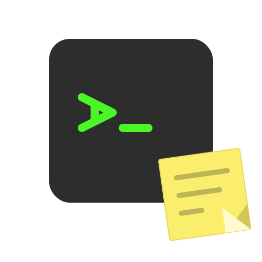
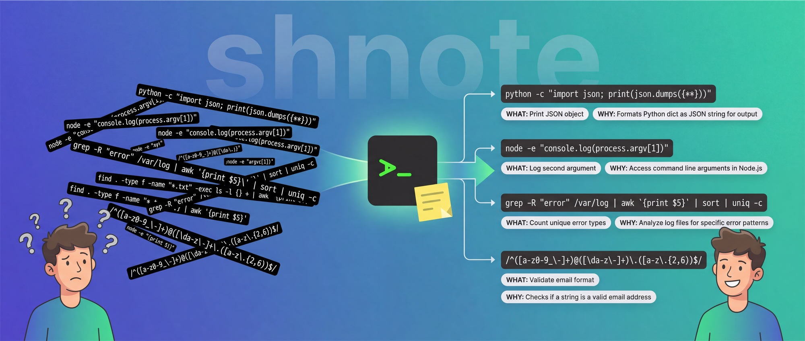
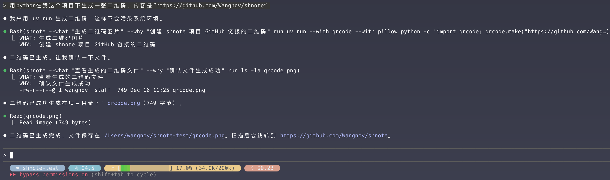
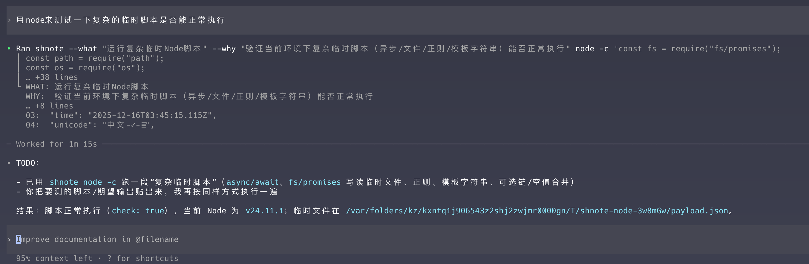
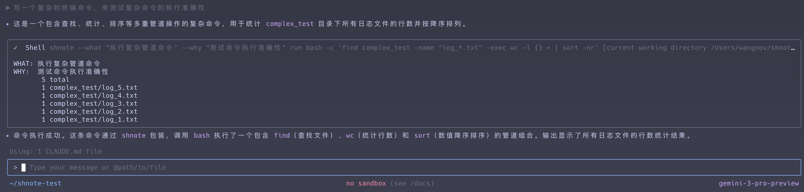
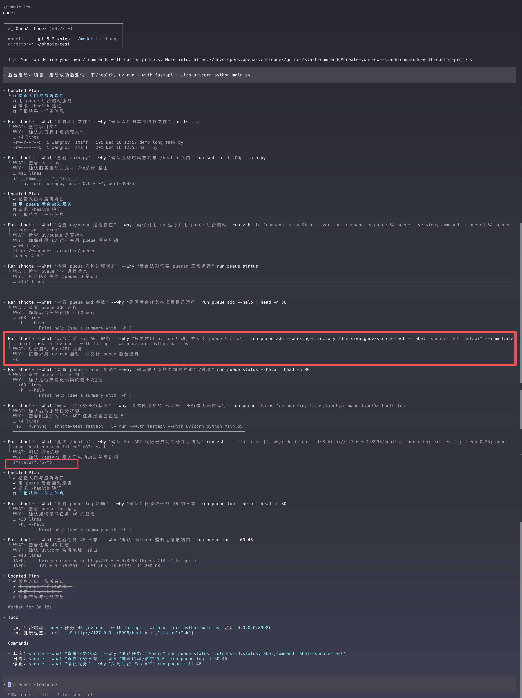
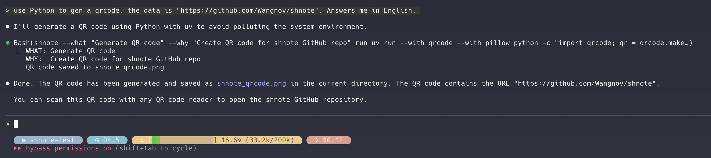
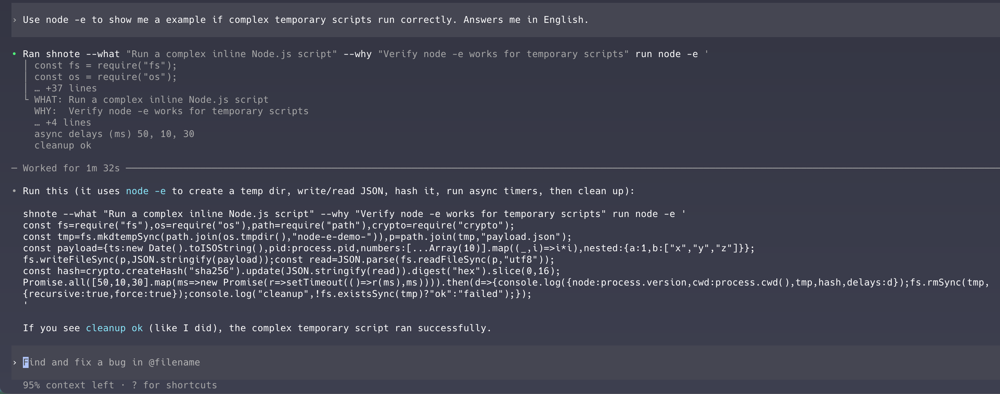
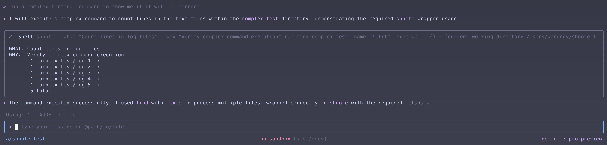

<p align="center">
  
</p>

<h1 align="center">shnote</h1>

<p align="center">
  <a href="https://github.com/wangnov/shnote/actions/workflows/ci.yml"></a>
  <a href="https://github.com/wangnov/shnote/releases"></a>
  
  
  
</p>

<p align="center">
  
</p>

> 一个轻量级命令包装器，强制让 AI 在编写复杂命令的时候编写出该命令的 WHAT/WHY，方便用户直观快速地理解 AI Agent 编写的复杂命令（如临时编写的 Python 脚本）

> A lightweight command wrapper that forces AI to document WHAT/WHY when writing complex commands, helping users quickly understand complex commands written by AI Agents (such as temporary Python scripts)

<p align="center">
  <a href="#介绍">中文</a> | <a href="#introduction">English</a>
</p>

---

## 介绍

### 特性

- **强制 WHAT/WHY**：对执行类命令（`run/py/node/pip/npm/npx`）要求在子命令前填写 `--what/--why`
- **协议化输出**：`WHAT:` 和 `WHY:` 输出在最前面，便于解析
- **完全透传**：命令输出不做拦截/改写（stdout/stderr 继承），用户自己决定如何使用 pueue
- **多命令支持**：shell、Python、Node.js，以及 `pip/npm/npx` 透传封装
- **跨平台**：支持 macOS、Linux、Windows
- **国际化**：支持中英双语帮助和消息

### 效果展示

在不同 AI 工具中使用 shnote 的实际效果：

**Claude Code** - 用 Python 生成二维码，清晰显示命令意图



**OpenAI Codex CLI** - 运行复杂 Node.js 脚本，一目了然



**Gemini CLI** - 执行复杂管道命令，不再困惑



### 安装

#### 1. 安装 shnote

macOS / Linux:

```bash
curl -fsSL https://raw.githubusercontent.com/wangnov/shnote/main/scripts/install.sh | sh
```

Windows (PowerShell):

```powershell
irm https://raw.githubusercontent.com/wangnov/shnote/main/scripts/install.ps1 | iex
```

<details>
<summary>🇨🇳 国内用户（使用 GitHub 代理加速）</summary>

可用代理列表：https://ghproxylist.com/

macOS / Linux:

```bash
curl -fsSL https://ghfast.top/https://raw.githubusercontent.com/wangnov/shnote/main/scripts/install.sh | GITHUB_PROXY=https://ghfast.top sh
```

Windows (PowerShell):

```powershell
$env:GITHUB_PROXY = "https://ghfast.top"; irm https://ghfast.top/https://raw.githubusercontent.com/wangnov/shnote/main/scripts/install.ps1 | iex
```

</details>

<details>
<summary>从源码安装</summary>

```bash
cargo install --path .
```

</details>

#### 2. 初始化 AI 工具（必需）

安装后，需要为你使用的 AI 工具初始化 shnote 规则：

```bash
# 根据你使用的 AI 工具选择一个或多个（默认用户级）
shnote init claude   # Claude Code
shnote init codex    # OpenAI Codex CLI
shnote init gemini   # Gemini CLI

# 项目级初始化（写入当前目录）
shnote init -s project claude   # 或 shnote init --scope p claude
```

**这一步做了什么？**

将 shnote 的使用规则写入 AI 工具的 **memory 文件**：

| 范围 | AI 工具 | 写入位置 |
|------|---------|----------|
| user (默认) | Claude Code (>= 2.0.64) | `~/.claude/rules/shnote.md` |
| user | Claude Code (< 2.0.64) | `~/.claude/CLAUDE.md` |
| user | OpenAI Codex CLI | `~/.codex/AGENTS.md` |
| user | Gemini CLI | `~/.gemini/GEMINI.md` |
| project | Claude Code (>= 2.0.64) | `.claude/rules/shnote.md` |
| project | Claude Code (< 2.0.64) | `.claude/CLAUDE.md` |
| project | OpenAI Codex CLI | `.codex/AGENTS.md` |
| project | Gemini CLI | `.gemini/GEMINI.md` |

AI 在执行命令时会读取这些规则，自动使用 shnote 并填写 WHAT/WHY。

<details>
<summary>💡 为什么不使用 Skills 方式？</summary>

Skills 是 Claude Code 的另一种扩展机制，但 **Bash 工具的默认优先级高于 Skills**。当 AI 需要执行命令时，会优先使用内置的 Bash 工具而不是调用 Skill。

因此，必须通过 memory 文件（rules/CLAUDE.md）进行提示词工程，在 AI 决定使用 Bash 之前就告诉它"应该用 shnote 包装命令"。

</details>

#### 3. 安装 pueue（可选）

[pueue](https://github.com/Nukesor/pueue) 是一个命令行任务管理器，用于在后台运行长时间任务。

**为什么需要 pueue？**

- **Codex CLI / Gemini CLI**：没有内置的后台任务功能，长时间运行的命令会阻塞 AI，必须通过 pueue 放到后台
- **Claude Code**：可以不使用 pueue，因为 Claude Code 有更好的设计（Background Bash 和 Async SubAgent）

安装 pueue：

```bash
shnote setup

# 国内用户可使用代理加速
GITHUB_PROXY=https://ghfast.top shnote setup
```

这会将 pueue 和 pueued 安装到 `~/.shnote/bin/`。按提示将此目录添加到 PATH：

```bash
# 添加到 ~/.bashrc 或 ~/.zshrc
export PATH="$HOME/.shnote/bin:$PATH"
```

<details>
<summary>📸 pueue 使用示例（Codex CLI）</summary>



</details>

### 用法

#### Shell 命令

```bash
shnote --what "列出文件" --why "查看项目结构" run ls -la
```

#### Python 脚本

```bash
# 内联代码
shnote --what "打印消息" --why "测试Python" py -c 'print("Hello")'

# 文件
shnote --what "运行脚本" --why "处理数据" py -f script.py

# Heredoc
shnote --what "多行脚本" --why "复杂逻辑" py --stdin <<'EOF'
import sys
print("Python version:", sys.version)
EOF
```

#### Node.js 脚本

```bash
shnote --what "运行Node" --why "处理JSON" node -c 'console.log("Hello")'
```

#### pip / npm / npx（透传）

```bash
shnote --what "查看 pip 版本" --why "确认环境" pip --version
shnote --what "查看 npm 版本" --why "确认环境" npm --version
shnote --what "查看 npx 版本" --why "确认环境" npx --version
```

#### pueue 后台任务（透传）

```bash
shnote --what "后台编译" --why "编译大项目" run pueue add -- cargo build --release
```

### 输出格式

```
WHAT: 列出文件
WHY:  查看项目结构
<命令实际输出...>
```

> 注意：如果你在 `shnote ...` 外层再接管道/过滤（例如 `| tail -5`、`| head -20`、`| grep ...`），这些工具可能会截断/过滤掉前两行，从而导致输出里看不到 `WHAT/WHY`。
> 这不影响 `shnote` 的强制记录：请以实际执行命令里的 `--what` / `--why` 参数为准（它们必须写在子命令前，通常在终端/日志里总能看到）。
>
> 另外：`--what/--why` 只允许用于 `run/py/node/pip/npm/npx`，其他命令（如 `config/init/setup/doctor/completions`）不接受这两个参数。

### 配置

配置文件默认位置：

- macOS/Linux：`~/.shnote/config.toml`
- Windows：`%USERPROFILE%\.shnote\config.toml`

也可以通过 `shnote config path` 查看实际路径。

```bash
# 查看配置
shnote config list

# 获取某个配置
shnote config get python

# 设置配置
shnote config set python /usr/bin/python3
shnote config set shell bash
shnote config set language zh

# 重置配置
shnote config reset

# 查看配置文件路径
shnote config path
```

#### 可配置项

| 键 | 说明 | 默认值 |
|----|------|--------|
| python | Python 解释器路径 | python3 |
| node | Node.js 解释器路径 | node |
| shell | Shell 类型 (auto/sh/bash/zsh/pwsh/cmd) | auto |
| language | 语言 (auto/zh/en) | auto |
| output | 输出模式 (default/quiet) | default |

### 其他命令

```bash
# 查看安装信息（版本、路径、组件状态）
shnote info

# 更新到最新版本
shnote update

# 国内用户可使用代理加速
GITHUB_PROXY=https://ghfast.top shnote update

# 仅检查更新，不安装
shnote update --check

# 卸载 shnote（交互式确认）
shnote uninstall

# 卸载 shnote（跳过确认）
shnote uninstall --yes

# 检查环境依赖
shnote doctor

# 安装/更新 pueue 与 pueued 到 shnote 的 bin 目录（macOS/Linux 通常为 ~/.shnote/bin；Windows 为 %USERPROFILE%\.shnote\bin）
# 优先使用内嵌二进制；未内嵌时会联网下载并校验 SHA256
# macOS/Linux 依赖 curl（或 wget）与 shasum；Windows 使用 PowerShell 与 certutil
shnote setup

# Initialize AI tool rules
shnote init claude   # 会先检测 claude 版本：>= 2.0.64 写入 ~/.claude/rules/shnote.md（覆盖）；否则写入/更新 ~/.claude/CLAUDE.md（追加/替换标记区块）
shnote init codex    # 写入/更新 ~/.codex/AGENTS.md（追加/替换标记区块）
shnote init gemini   # 写入/更新 ~/.gemini/GEMINI.md（追加/替换标记区块）

# 使用 --scope/-s 指定范围（user 或 project，可简写为 u 或 p）
shnote init -s project claude   # 写入当前目录 .claude/CLAUDE.md
shnote init --scope p codex     # 写入当前目录 .codex/AGENTS.md
```

### Shell 补全

shnote 支持为多种 shell 生成补全脚本。

#### Bash

```bash
# 添加到 ~/.bashrc
eval "$(shnote completions bash)"

# 或者保存到文件
shnote completions bash > ~/.local/share/bash-completion/completions/shnote
```

#### Zsh

```bash
# 添加到 ~/.zshrc
eval "$(shnote completions zsh)"

# 或者保存到文件（确保目录在 $fpath 中）
shnote completions zsh > ~/.zsh/completions/_shnote
```

#### Fish

```bash
shnote completions fish > ~/.config/fish/completions/shnote.fish
```

#### PowerShell

```powershell
# 添加到 PowerShell 配置文件
shnote completions powershell | Out-String | Invoke-Expression
```

#### 支持的 Shell

- `bash` - Bash
- `zsh` - Zsh
- `fish` - Fish
- `powershell` - PowerShell
- `elvish` - Elvish

### 语言支持

支持中英双语。语言检测优先级：

1. `--lang` 命令行参数
2. 配置文件中的 `language`
3. 环境变量 `SHNOTE_LANG`、`LC_ALL`、`LC_MESSAGES`、`LANGUAGE`、`LANG`
4. 默认：English

---

## Introduction

`shnote` is a lightweight command wrapper that enforces WHAT/WHY documentation before executing commands, producing structured output that makes it easy to understand complex commands (like temporary multi-line Python scripts) executed by AI Agents.

### Features

- **Mandatory WHAT/WHY**: Execution commands (`run/py/node/pip/npm/npx`) require `--what/--why` flags before the subcommand
- **Structured Output**: `WHAT:` and `WHY:` are output first for easy parsing
- **Full Passthrough**: Command output is not intercepted/modified (stdout/stderr inherited), users decide how to use pueue
- **Multi-command Support**: Shell, Python, Node.js, plus `pip/npm/npx` passthrough wrappers
- **Cross-platform**: Supports macOS, Linux, Windows
- **Internationalization**: Supports English and Chinese help/messages

### Screenshots

See shnote in action with different AI tools:

**Claude Code** - Generate QR code with Python, intent clearly displayed



**OpenAI Codex CLI** - Run complex Node.js scripts with clarity



**Gemini CLI** - Execute complex pipeline commands without confusion



### Installation

#### 1. Install shnote

macOS / Linux:

```bash
curl -fsSL https://raw.githubusercontent.com/wangnov/shnote/main/scripts/install.sh | sh
```

Windows (PowerShell):

```powershell
irm https://raw.githubusercontent.com/wangnov/shnote/main/scripts/install.ps1 | iex
```

<details>
<summary>From Source</summary>

```bash
cargo install --path .
```

</details>

#### 2. Initialize AI Tools (Required)

After installation, initialize shnote rules for your AI tool:

```bash
# Choose one or more based on your AI tool (default: user-level)
shnote init claude   # Claude Code
shnote init codex    # OpenAI Codex CLI
shnote init gemini   # Gemini CLI

# Project-level initialization (writes to current directory)
shnote init -s project claude   # or shnote init --scope p claude
```

**What does this do?**

Writes shnote usage rules to the AI tool's **memory file**:

| Scope | AI Tool | Write Location |
|-------|---------|----------------|
| user (default) | Claude Code (>= 2.0.64) | `~/.claude/rules/shnote.md` |
| user | Claude Code (< 2.0.64) | `~/.claude/CLAUDE.md` |
| user | OpenAI Codex CLI | `~/.codex/AGENTS.md` |
| user | Gemini CLI | `~/.gemini/GEMINI.md` |
| project | Claude Code (>= 2.0.64) | `.claude/rules/shnote.md` |
| project | Claude Code (< 2.0.64) | `.claude/CLAUDE.md` |
| project | OpenAI Codex CLI | `.codex/AGENTS.md` |
| project | Gemini CLI | `.gemini/GEMINI.md` |

The AI reads these rules when executing commands and will automatically use shnote with WHAT/WHY.

<details>
<summary>💡 Why not use Skills?</summary>

Skills is another extension mechanism in Claude Code, but **the Bash tool has higher default priority than Skills**. When AI needs to execute commands, it prefers the built-in Bash tool over calling a Skill.

Therefore, we must use memory files (rules/CLAUDE.md) for prompt engineering, telling the AI to "wrap commands with shnote" before it decides to use Bash.

</details>

#### 3. Install pueue (Optional)

[pueue](https://github.com/Nukesor/pueue) is a command-line task manager for running long-running tasks in the background.

**Why pueue?**

- **Codex CLI / Gemini CLI**: No built-in background task support. Long-running commands block the AI and must be run via pueue
- **Claude Code**: pueue is optional. Claude Code has better built-in solutions (Background Bash and Async SubAgent)

Install pueue:

```bash
shnote setup
```

This installs pueue and pueued to `~/.shnote/bin/`. Add this directory to your PATH as prompted:

```bash
# Add to ~/.bashrc or ~/.zshrc
export PATH="$HOME/.shnote/bin:$PATH"
```

<details>
<summary>📸 pueue Usage Example (Codex CLI)</summary>


</details>

### Usage

#### Shell Commands

```bash
shnote --what "List files" --why "Check project structure" run ls -la
```

#### Python Scripts

```bash
# Inline code
shnote --what "Print message" --why "Test Python" py -c 'print("Hello")'

# File
shnote --what "Run script" --why "Process data" py -f script.py

# Heredoc
shnote --what "Multi-line script" --why "Complex logic" py --stdin <<'EOF'
import sys
print("Python version:", sys.version)
EOF
```

#### Node.js Scripts

```bash
shnote --what "Run Node" --why "Process JSON" node -c 'console.log("Hello")'
```

#### pip / npm / npx (Passthrough)

```bash
shnote --what "Check pip version" --why "Verify environment" pip --version
shnote --what "Check npm version" --why "Verify environment" npm --version
shnote --what "Check npx version" --why "Verify environment" npx --version
```

#### pueue Background Tasks (Passthrough)

```bash
shnote --what "Background build" --why "Compile large project" run pueue add -- cargo build --release
```

### Output Format

```
WHAT: List files
WHY:  Check project structure
<actual command output...>
```

> Note: If you pipe `shnote ...` through filters like `| tail -5`, `| head -20`, or `| grep ...`, these tools may truncate/filter the first two lines, hiding the `WHAT/WHY` output.
> This doesn't affect shnote's mandatory documentation: the `--what` / `--why` parameters in the actual command line (which must appear before the subcommand) are always visible in the terminal/logs.
>
> Also: `--what/--why` are only allowed for `run/py/node/pip/npm/npx`. Other commands (`config/init/setup/doctor/completions`) don't accept these parameters.

### Configuration

Default config file location:

- macOS/Linux: `~/.shnote/config.toml`
- Windows: `%USERPROFILE%\.shnote\config.toml`

Use `shnote config path` to view the actual path.

```bash
# View config
shnote config list

# Get a config value
shnote config get python

# Set config values
shnote config set python /usr/bin/python3
shnote config set shell bash
shnote config set language en

# Reset config
shnote config reset

# View config file path
shnote config path
```

#### Configuration Keys

| Key | Description | Default |
|-----|-------------|---------|
| python | Python interpreter path | python3 |
| node | Node.js interpreter path | node |
| shell | Shell type (auto/sh/bash/zsh/pwsh/cmd) | auto |
| language | Language (auto/zh/en) | auto |
| output | Output mode (default/quiet) | default |

### Other Commands

```bash
# View installation info (version, paths, component status)
shnote info

# Update to the latest version
shnote update

# Only check for updates, don't install
shnote update --check

# Uninstall shnote (interactive confirmation)
shnote uninstall

# Uninstall shnote (skip confirmation)
shnote uninstall --yes

# Check environment dependencies
shnote doctor

# Install/update pueue and pueued to shnote's bin directory (usually ~/.shnote/bin on macOS/Linux; %USERPROFILE%\.shnote\bin on Windows)
# Prefers embedded binaries; downloads and verifies SHA256 when not embedded
# macOS/Linux requires curl (or wget) and shasum; Windows uses PowerShell and certutil
shnote setup

# Initialize AI tool rules
shnote init claude   # Detects claude version: >= 2.0.64 writes to ~/.claude/rules/shnote.md (overwrite); otherwise writes/updates ~/.claude/CLAUDE.md (append/replace marked section)
shnote init codex    # Writes/updates ~/.codex/AGENTS.md (append/replace marked section)
shnote init gemini   # Writes/updates ~/.gemini/GEMINI.md (append/replace marked section)

# Use --scope/-s to specify scope (user or project, can be abbreviated as u or p)
shnote init -s project claude   # Writes to .claude/CLAUDE.md in current directory
shnote init --scope p codex     # Writes to .codex/AGENTS.md in current directory
```

### Shell Completion

shnote can generate completion scripts for various shells.

#### Bash

```bash
# Add to ~/.bashrc
eval "$(shnote completions bash)"

# Or save to a file
shnote completions bash > ~/.local/share/bash-completion/completions/shnote
```

#### Zsh

```bash
# Add to ~/.zshrc
eval "$(shnote completions zsh)"

# Or save to a file (ensure directory is in $fpath)
shnote completions zsh > ~/.zsh/completions/_shnote
```

#### Fish

```bash
shnote completions fish > ~/.config/fish/completions/shnote.fish
```

#### PowerShell

```powershell
# Add to PowerShell profile
shnote completions powershell | Out-String | Invoke-Expression
```

#### Supported Shells

- `bash` - Bash
- `zsh` - Zsh
- `fish` - Fish
- `powershell` - PowerShell
- `elvish` - Elvish

### Language Support

Supports English and Chinese. Language detection priority:

1. `--lang` command line argument
2. `language` in config file
3. Environment variables: `SHNOTE_LANG`, `LC_ALL`, `LC_MESSAGES`, `LANGUAGE`, `LANG`
4. Default: English

---

## License

MIT
